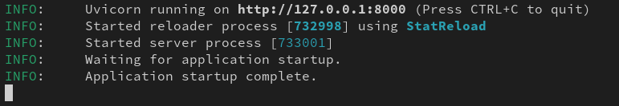
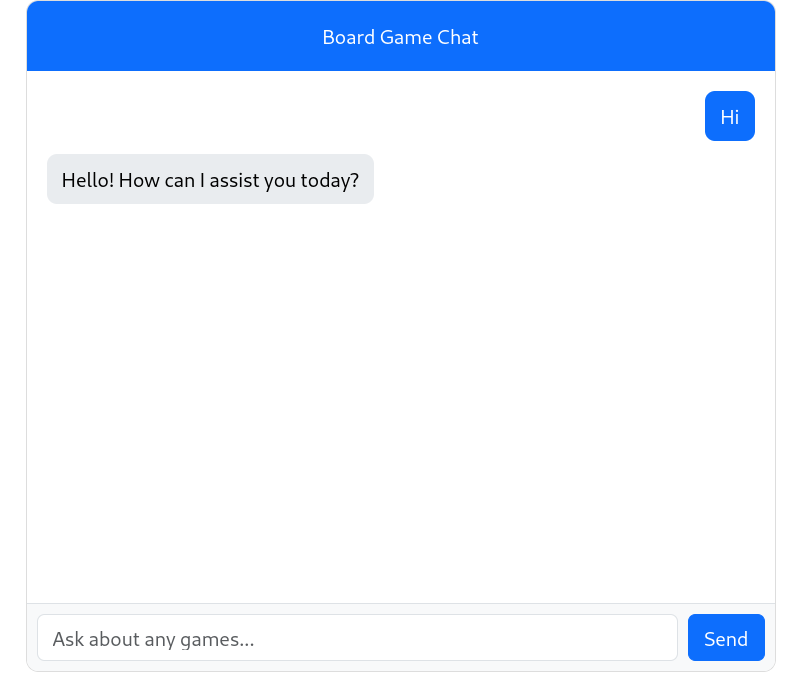

# Board Game Advisor Chat
Chat application that integrates with a large language model (LLM) to create a Retrieval-Augmented Generation (RAG) system using a vector database.

## Endpoints

1. `GET /` 

    Serves the user interface (UI) where users can interact with the system.

2. `POST /chat`

    Manages the conversation between the user and the model.

3. `POST /search-game`

    Allows the user to search for board games based on a query.

4. `POST /recommend`

        Recommends board games to the user based on their previous preferences stored in the system.


## Installation and launch

1. Clone repositories:

   Via HTTP
   ```bash
   git clone https://github.com/Duanex-IT/Board-Game-Advisor.git
   ```

   Via SSH
   ```bash
   git clone git@github.com:Duanex-IT/Board-Game-Advisor.git
   ```
2. Install the virtual environment and activate it:
   ```bash
    python3 -m venv venv
    source venv/bin/activate  # For Windows, use `venv\Scripts\activate`
    ```
3. Install all dependencies:
   ```bash
    pip install -r requirements.txt
    ```

4. And since we are using a proprietary model from OpenAI, we will need their API key. Which we store in the `.env` file accordingly:
    ```bash
    OPENAI_API_KEY = "sk-proj-...
    ```

5. To start in development environment:
    ```bash
    uvicorn chat:app --reload
    ```
   And for production:
    ```bash
    uvicorn chat:app --host 0.0.0.0 --port 8000 
    ```

6. If the previous steps were performed correctly, you will see:

    

7. And now after switching to localhost you can start chatting:

    


    